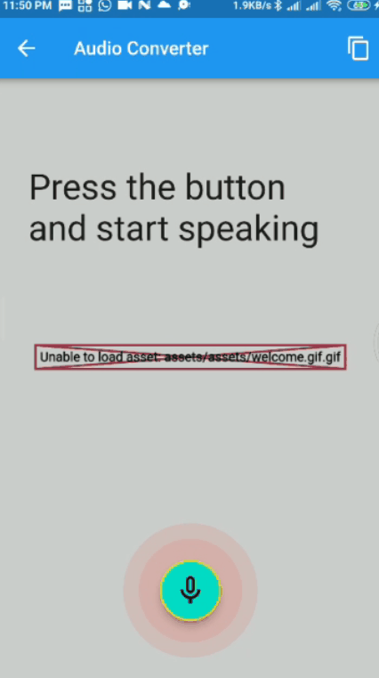

# Sprints-NAID-Flutter

# HEARU APP for PWDs with hearing impairment.

<p align="center">
  
     
     
</p>
 

# Final Project for NAID \& Sprints


## Project Description 
Techniques to make online media accessible to people with hearing loss are limited due to the
lack of structure in the education of hearing impaired and regional differences which affect the
language building skills of a student.\
the early development of  language learning and communication skills essential for the education of children with a profound hearing loss.\
The goals of our proposed app involve reducing the burden of teachers and to act as a valuable teaching aid. Allows for easy translation of any online video to reinforce language building skills and online media accessibility for PWDs
with hearing impairment.

### Steps

- YouTube API is used to display some useful playlists which can act as demo for our purposes along with playing the video in our app with the sign language translation. This was done using `youtube_player_flutter` and `http`
- The video gets converted to text via subtitles and speech processing methods using `youtube_explode_dart`.
- The generated text is understood through text processing using `lemmatizer` to remove stop words and map the text easily to 
sign language. **Normally this processing require NLP techniques to better understand and analyze the text to keep the context of the sentence**
-  Analyzed text is mapped to saved gifs in the assets folder with some sort of syncronization between the choosen video. **NormallyThe generated text is understood through NLP algorithms and then mapped to avatar captions
which are then rendered to form a cohesive video alongside the original content.**


#### References
[[1] Automated 3D sign language caption generation for video](https://link.springer.com/article/10.1007/s10209-019-00668-9)

[[2] Text2Sign: Towards Sign Language Production Using Neural Machine](https://link.springer.com/article/10.1007/s11263-019-01281-2)


## Speech to Sign Language
 This will help the user communicate effectively with other people. 

<p align="center">
  
</p>

## Video to Sign Language
This will make online media accessible to people with hearing impairment.
<p align="center">
  
</p>


## Project Tools \& Demos

|   |                                  |            |
|:--:|:----------------------------------------------------------------------------------------:|:------------------------:|
|   http |     youtube_player_flutter   |  url_launcher      |
| path_provider    |  image_picker      |    youtube_explode_dart    |
| lemmatizer   |     animated_theme_switcher   |    clipboard    |
| avatar_glow   |   speech_to_text     |    youtube_player_flutter    |
|  url_launcher  |      path_provider  |    cupertino_icons    |
|   |                                  |            |


## Problems Encountered 

- [unsound-null-safety-> Working with legacy package lemmatizer](https://dart.dev/null-safety/unsound-null-safety)
- Sync video with generated sign language.
- play and pause generated sign language.


## Project Build apk 
```dart
flutter build apk --release --no-sound-null-safety
```


## About the Project

This Project is part of the NAID Mobile App Internship hosted and managed by Sprints concerning Flutter. We learned a lot of topics with hands 
on implementations from the UI to the API handling. A complete list of tasks with descriptions are listed below:

## Projects List

|  # |                                      Flutter                               |          Status          |
|:--:|:----------------------------------------------------------------------------------------:|:------------------------:|
| 01 |          [Dart Functions](https://github.com/mohamed-abdelaziz721/flutter/tree/master/projects-readme/dart_functions) |    :heavy_check_mark:    |
| 02 |          [Signin Form](https://github.com/mohamed-abdelaziz721/flutter/tree/master/projects-readme/signin_form)          |    :heavy_check_mark:    |
| 03 |          [Layout Exercise](https://github.com/mohamed-abdelaziz721/flutter/tree/master/projects-readme/layout_exercise)              |    :heavy_check_mark:  
| 04 |          [Page Navigation](https://github.com/mohamed-abdelaziz721/flutter/tree/master/projects-readme/page_navigation)              |   :heavy_check_mark:   |
| 05 |          [Http Request](https://github.com/mohamed-abdelaziz721/flutter/tree/master/projects-readme/http_request)              |   :heavy_check_mark:     |
| 06 |          [Release Settings](https://github.com/mohamed-abdelaziz721/flutter/tree/master/projects-readme/release_settings)              |   :heavy_check_mark:     |
| 07 |          [Bottom Navigation Bar & Links](https://github.com/mohamed-abdelaziz721/flutter/tree/master/projects-readme/bottom_navbar)              |   :heavy_check_mark:     |
| 08 |          [Rounded Appbar - Adobe XD](https://github.com/mohamed-abdelaziz721/flutter/tree/dev/projects-readme/appbar_rounded_adobe_xd)              |   :heavy_check_mark:     |


|  # |                                       Java                                      |          Status          |
|:--:|:----------------------------------------------------------------------------------------:|:------------------------:|
| 01 | [LoginForm  with Linear Layout](https://github.com/mohamed-abdelaziz721/Login-Form) |    :heavy_check_mark:    |
| 02 |          [Relative Layout](https://github.com/mohamed-abdelaziz721/Relative-Layout)          |    :heavy_check_mark:    |
| 03 |          [Constraint Layout](https://github.com/mohamed-abdelaziz721/Constraint-Layout)              |    :heavy_check_mark:    |
| 04 | [Navigation Throught Activities](https://github.com/mohamed-abdelaziz721/Navigation-Throught-Activities)              |    :heavy_check_mark:    |
| 05 | [Accessibility App](https://github.com/mohamed-abdelaziz721/Accessibility-App)              |    :heavy_check_mark:    |


## Tools 
- Android Studio
- Flutter 
- Dart
- Java

## Prerequisites
A good Understanding of `Java`, `OOP`, `dart`  and one of its GUI Components (Android Studio)\
However, you can apply the concepts of the projects with any other preferred programming language.


## Supervision
Sprints - NAID
> Eng. Omar Sherif
> 
> Eng. Nourhan Gehad 
> 
> Eng. Mohamed Hefney 


