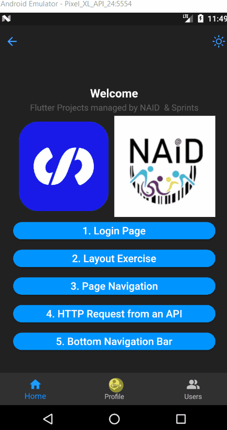

# Sprints-NAID-Flutter

 This repository show my implementations of  flutter projects with Sprints and NAID.

  
     
     

 
## Http Request

## Http Request

  

### What has been Done! 
- Added url_launcher functionality to users data (email - phone - website) 
    - `lib->projects->http_api->utils.dart`
    - `lib->projects->http_api->screens->user_details.dart`
  
- Added Bottom Navigation bar   
    - `bottom_navbar.dart`

## Projects List

|  # |                                       Project Name                                       |          Status          |
|:--:|:----------------------------------------------------------------------------------------:|:------------------------:|
| 01 | [Dart Functions](https://github.com/mohamed-abdelaziz721/flutter/tree/master/projects-readme/dart_functions) |    :heavy_check_mark:    |
| 02 |          [Signin Form](https://github.com/mohamed-abdelaziz721/flutter/tree/master/projects-readme/signin_form)          |    :heavy_check_mark:    |
| 03 |          [Layout Exercise](https://github.com/mohamed-abdelaziz721/flutter/tree/master/projects-readme/layout_exercise)              |    :heavy_check_mark:  
| 04 |          [Page Navigation](https://github.com/mohamed-abdelaziz721/flutter/tree/master/projects-readme/page_navigation)              |   :heavy_check_mark:   |
| 05 |          [Http Request](https://github.com/mohamed-abdelaziz721/flutter/tree/master/projects-readme/http_request)              |   :heavy_check_mark:     |
| 06 |          [Release Settings](https://github.com/mohamed-abdelaziz721/flutter/tree/master/projects-readme/release_settings)              |   :heavy_check_mark:     |
| 07 |          [Bottom Navigation Bar & Links](https://github.com/mohamed-abdelaziz721/flutter/tree/master/projects-readme/bottom_navbar)              |   :heavy_check_mark:     |

## About the Project

This Project is part of the NAID Mobile App Internship hosted and managed by Sprints concerning Flutter. 

## Tools 
- Android Studio
- Flutter 
- Dart

## Prerequisites
A good Understanding of `Java`, `OOP`, `Dart`  and one of its GUI Components (Android Studio)\
However, you can apply the concepts of the projects with any other preferred programming language.

## Supervision
> Eng. Omar Sherif - Sprints - NAID

