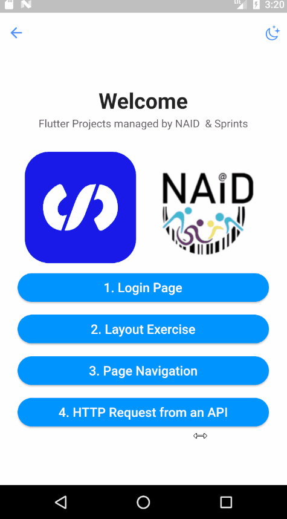
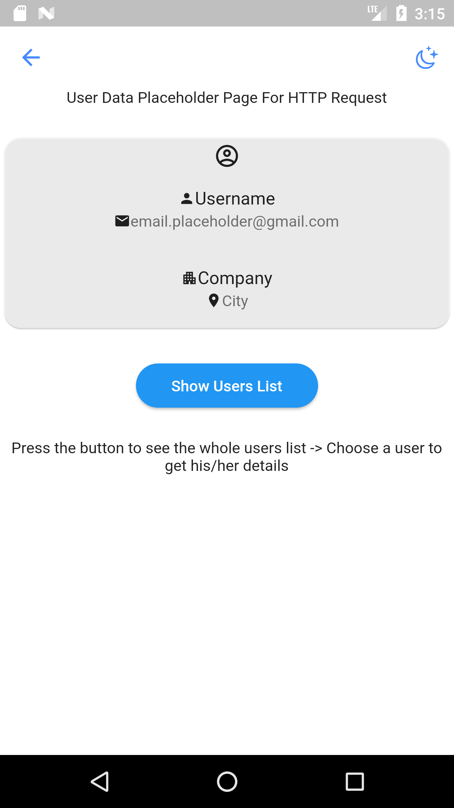
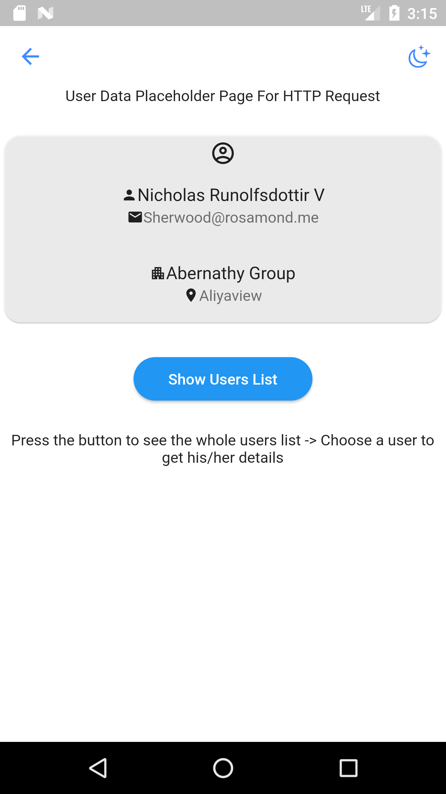

# Sprints-NAID-Flutter

 This repository show my implementations of  flutter projects with Sprints and NAID.

  
     
     

 
## Http Request

## Http Request

  

  
  
  

### What has been Done! 
 Added button in the Home Screen for the http task.\

- user_details.dart
- user_screen.dart \
  The above files were added in `projects -> http_api -> screens`.
- user.dart\
  The above file was added in `projects -> http_api -> model`.
- user_service.dart\
  The above files was added in `projects -> http_api -> services`.

They contain a landing page with cardview which act as a placeholder for users details. The button in the `user_details.dart` page generate the http request to get users from 
an API.\
When tapping on any user its corresponding details will be passed to the placeholder page along with screen being popped from the stack
and re-routed to the placeholder page.

## Projects List

|  # |                                       Project Name                                       |          Status          |
|:--:|:----------------------------------------------------------------------------------------:|:------------------------:|
| 01 | [Dart Functions](https://github.com/mohamed-abdelaziz721/flutter/tree/master/projects-readme/dart_functions) |    :heavy_check_mark:    |
| 02 |          [Signin Form](https://github.com/mohamed-abdelaziz721/flutter/tree/master/projects-readme/signin_form)          |    :heavy_check_mark:    |
| 03 |          [Layout Exercise](https://github.com/mohamed-abdelaziz721/flutter/tree/master/projects-readme/layout_exercise)              |    :heavy_check_mark:  
| 04 |          [Page Navigation](https://github.com/mohamed-abdelaziz721/flutter/tree/master/projects-readme/page_navigation)              |   :heavy_check_mark:   |
| 05 |          [Http Request](https://github.com/mohamed-abdelaziz721/flutter/tree/master/projects-readme/http_request)              |   :heavy_check_mark:     |
| 06 |          [Release Settings](https://github.com/mohamed-abdelaziz721/flutter/tree/master/projects-readme/release_settings)              |   :heavy_check_mark:     |

## About the Project

This Project is part of the NAID Mobile App Internship hosted and managed by Sprints concerning Flutter. 

## Tools 
- Android Studio
- Flutter 
- Dart

## Prerequisites
A good Understanding of `Java`, `OOP`, `Dart`  and one of its GUI Components (Android Studio)\
However, you can apply the concepts of the projects with any other preferred programming language.

## Supervision
> Eng. Omar Sherif - Sprints - NAID

