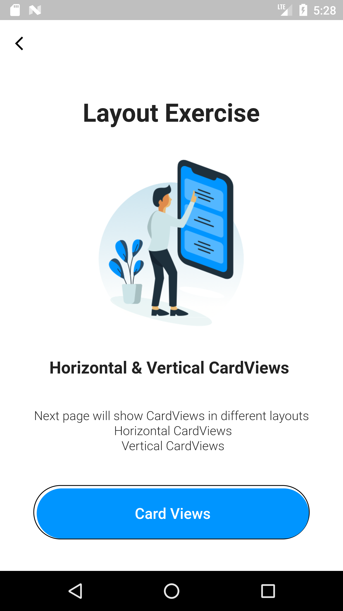
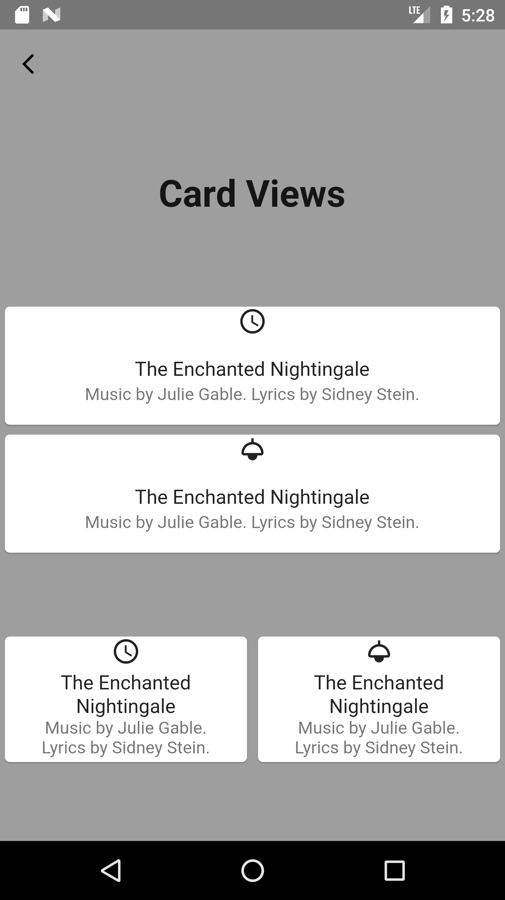

# Sprints-NAID-Flutter

 This repository show my implementations of  flutter projects with Sprints and NAID.

  
     
     

 
## Layout Exercise

  
  

### What has been Done! 
- cardview1.dart
- h_v_cardviews1.dart

The above files was added in `projects -> layout_excersice -> screens`.
They contain a landing page for cardviews and the button navigates to a new page that contain horizontal and vertical cards.

## Projects List

|  # |                                       Project Name                                       |          Status          |
|:--:|:----------------------------------------------------------------------------------------:|:------------------------:|
| 01 | [Dart Functions](https://github.com/mohamed-abdelaziz721/flutter/tree/master/projects-readme/dart_functions) |    :heavy_check_mark:    |
| 02 |          [Signin Form](https://github.com/mohamed-abdelaziz721/flutter/tree/master/projects-readme/signin_form)          |    :heavy_check_mark:    |
| 03 |          [Layout Exercise](https://github.com/mohamed-abdelaziz721/flutter/tree/master/projects-readme/layout_exercise)              |    :heavy_check_mark:  
| 04 |          [Page Navigation](https://github.com/mohamed-abdelaziz721/flutter/tree/master/projects-readme/page_navigation)              |   :hourglass_flowing_sand:    |

## About the Project

This Project is part of the NAID Mobile App Internship hosted and managed by Sprints concerning Flutter. 

## Tools 
- Android Studio
- Flutter 
- Dart

## Prerequisites
A good Understanding of `Java`, `OOP`  and one of its GUI Components (Android Studio)\
However, you can apply the concepts of the projects with any other prefered programming language.

## Supervision
> Eng. Omar Sherif - Sprints - NAID

